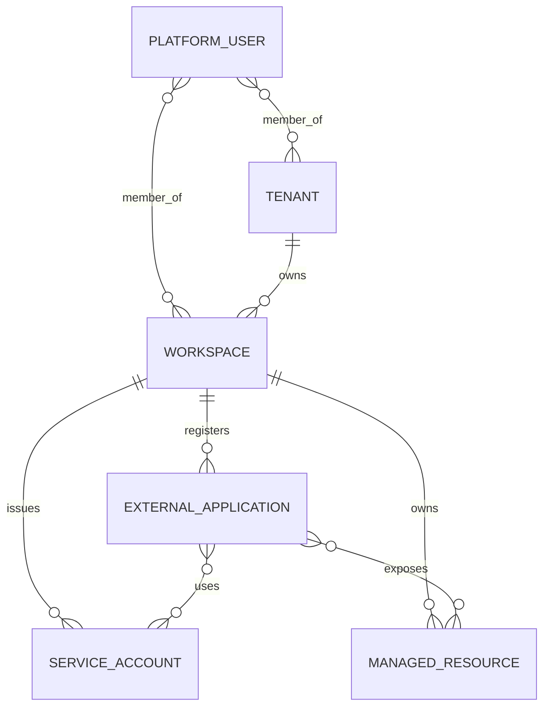

# Core Domain Model

This note complements `ADR 0006` and the machine-readable contract in `services/internal-contracts/src/domain-model.json`.

## Goal

Give the platform one reusable entity language for the product's control-plane surface before runtime modules, persistence layers, and UI flows multiply.

## Canonical entities

| Entity | Scope | Parent | Purpose |
| --- | --- | --- | --- |
| `platform_user` | platform | none | Human operator identity plus tenant/workspace memberships |
| `tenant` | platform | none | Commercial + operational customer boundary |
| `workspace` | tenant | tenant | Delivery/runtime boundary inside one tenant |
| `external_application` | workspace | workspace | App/client registration and redirect policy |
| `service_account` | workspace | workspace | Non-human automation identity |
| `managed_resource` | workspace | workspace | Provisioned backing resource registry |

## Shared baseline

All entities share the following baseline:

- identifier format: `<prefix>_<ulid>`
- lowercase URL-safe slugs
- lifecycle states: `draft`, `provisioning`, `active`, `suspended`, `soft_deleted`
- timestamps: `created_at`, `updated_at`, and optional lifecycle timestamps
- additive, non-secret metadata
- logical soft delete before physical purge

## Domain diagram

## Business integrity rules

### Tenant and workspace boundary

- Every non-platform entity carries `tenantId`.
- `workspaceId` is mandatory for workspace-owned entities.
- A workspace belongs to exactly one tenant and cannot migrate silently.
- Cross-tenant or cross-workspace references are invalid even when raw identifiers exist.

### Lifecycle safety

- Descendants cannot remain active while an ancestor is suspended or soft-deleted.
- `desired_state` expresses requested intent; lifecycle events capture realized state transitions.
- Soft-deleted identifiers remain reserved until an explicit purge path exists.

### Security and provider boundaries

- `platform_user` is the human actor entity.
- `service_account` is the workload actor entity.
- Provider credentials, secrets, and private keys are not stored in canonical entity metadata.
- `managed_resource.kind` remains provider-agnostic and maps to authorization resource types.

## Lifecycle events

Each core entity publishes four baseline lifecycle events:

- `.created`
- `.activated`
- `.suspended`
- `.soft_deleted`

Every lifecycle event carries:

- entity type + identifier
- tenant/workspace bindings
- transition id
- state before + state after
- actor
- correlation id
- timestamp

## OpenAPI contract mapping

The control-plane contract provides a canonical read path and write path for each entity. Write operations are asynchronous-friendly and return one accepted mutation envelope instead of implying immediate provisioning completion.

| Entity | Read path | Write path |
| --- | --- | --- |
| `platform_user` | `GET /v1/platform-users/{userId}` | `POST /v1/platform-users` |
| `tenant` | `GET /v1/tenants/{tenantId}` | `POST /v1/tenants` |
| `workspace` | `GET /v1/tenants/{tenantId}/workspaces/{workspaceId}` | `POST /v1/tenants/{tenantId}/workspaces` |
| `external_application` | `GET /v1/workspaces/{workspaceId}/external-applications/{applicationId}` | `POST /v1/workspaces/{workspaceId}/external-applications` |
| `service_account` | `GET /v1/workspaces/{workspaceId}/service-accounts/{serviceAccountId}` | `POST /v1/workspaces/{workspaceId}/service-accounts` |
| `managed_resource` | `GET /v1/workspaces/{workspaceId}/managed-resources/{resourceId}` | `POST /v1/workspaces/{workspaceId}/managed-resources` |

## Seed fixture profiles

The baseline seed package in `tests/reference/domain-seed-fixtures.json` intentionally covers three sizes:

1. `starter-single-workspace` — one shared-schema tenant and one active dev workspace
2. `growth-multi-workspace` — one shared-schema tenant with dev/staging/prod workspaces
3. `enterprise-dedicated` — one dedicated-database tenant with four workspaces and stricter operational shape

Use those profiles for contract tests, demo data planning, and future fixture builders before inventing new canonical examples.
